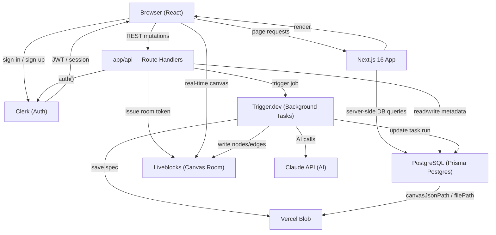
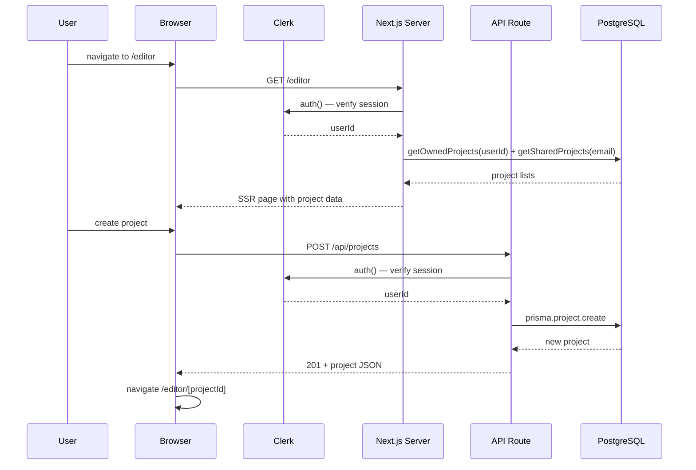
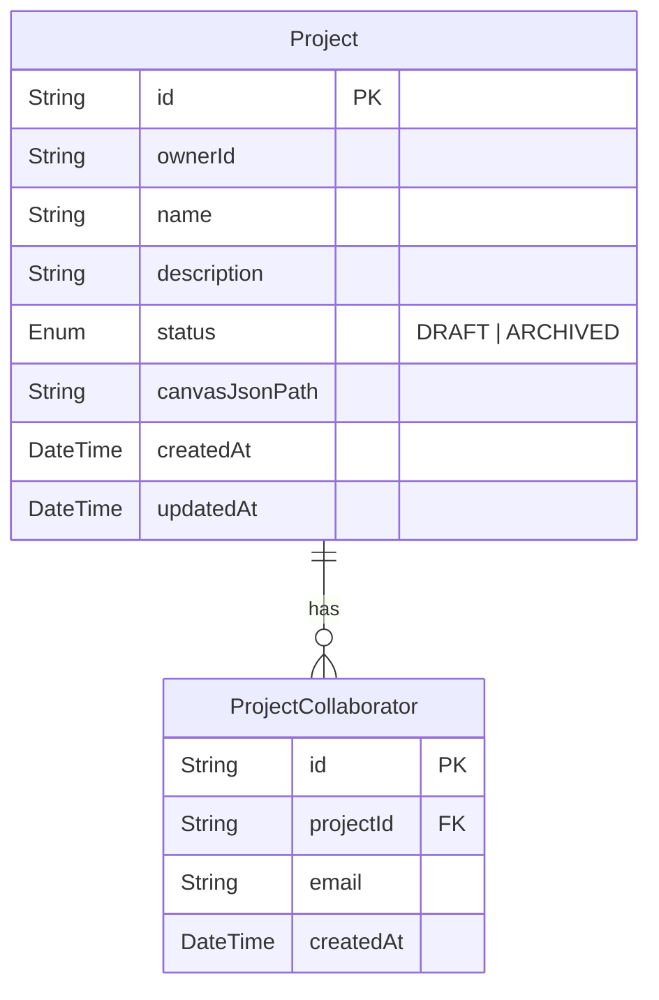
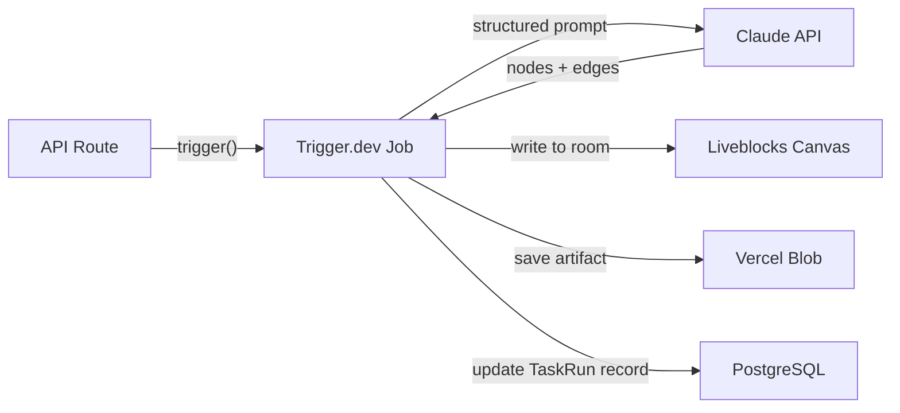

# Ghost AI — Architecture

Real-time collaborative system design workspace. Users describe a system in plain English, an AI agent maps it onto a shared canvas, collaborators refine the design, and the app generates a technical specification from the resulting graph.

---

## Stack

| Layer            | Technology                          | Role                                                           |
| ---------------- | ----------------------------------- | -------------------------------------------------------------- |
| Framework        | Next.js 16 + TypeScript             | Full-stack app with server/client boundaries                   |
| UI               | Tailwind v4 + shadcn/ui (base-nova) | Component composition and styling                              |
| Auth             | Clerk v7                            | User identity and route protection                             |
| Database         | Prisma v7 + PostgreSQL              | Relational metadata: projects, collaborators, specs, task runs |
| Canvas           | Liveblocks + React Flow             | Real-time collaborative canvas, presence, cursors              |
| Background tasks | Trigger.dev                         | Durable AI generation workflows                                |
| Artifact storage | Vercel Blob                         | Canvas snapshots and generated Markdown specs                  |

---

## High-Level System Diagram



---

## Request / Auth Flow



---

## Data Model



**Storage split:**

- `projects` and `project_collaborators` tables live in PostgreSQL.
- Canvas content is stored in Vercel Blob at `canvas/{projectId}.json`; the URL is the value of `canvasJsonPath`.
- Generated specs are stored at `specs/{projectId}/{specId}.md`; the URL is stored in a spec record `filePath` (not yet implemented).

---

## Directory Structure

```text
ghost-ai/
├── app/
│   ├── api/
│   │   └── projects/
│   │       ├── route.ts              # GET list, POST create
│   │       └── [projectId]/
│   │           └── route.ts          # PATCH rename, DELETE delete
│   ├── editor/
│   │   └── page.tsx                  # SSR: fetch projects, render EditorShell
│   ├── sign-in/[[...sign-in]]/
│   ├── sign-up/[[...sign-up]]/
│   ├── generated/prisma/             # Prisma-generated client (do not edit)
│   ├── globals.css                   # Tailwind v4 CSS-first tokens
│   ├── layout.tsx                    # ClerkProvider + dark class on <html>
│   └── page.tsx                      # Root: redirect auth'd → /editor
├── components/
│   ├── editor/
│   │   ├── editor-navbar.tsx
│   │   ├── editor-shell.tsx          # Client wrapper for editor page
│   │   ├── project-dialogs.tsx
│   │   └── project-sidebar.tsx
│   └── ui/                           # shadcn/ui components (do not edit)
├── hooks/
│   └── use-project-actions.ts        # Dialog state + API mutations
├── lib/
│   ├── prisma.ts                     # Singleton PrismaClient with PrismaPg + Accelerate
│   ├── projects.ts                   # Server-only DB query helpers
│   ├── slug.ts
│   └── utils.ts                      # cn() helper
├── prisma/
│   ├── schema.prisma                 # Generator + datasource
│   ├── models/
│   │   └── project.prisma            # Project + ProjectCollaborator models
│   └── migrations/
├── types/
│   └── project.ts                    # Re-exports Prisma Project type
├── context/                          # Living documentation (not shipped)
├── proxy.ts                          # Clerk middleware (Next.js 16 convention)
└── docs/
    └── architecture.md               # This file
```

---

## API Routes

| Method   | Path                        | Auth       | Description                               |
| -------- | --------------------------- | ---------- | ----------------------------------------- |
| `GET`    | `/api/projects`             | Required   | List caller's owned projects              |
| `POST`   | `/api/projects`             | Required   | Create a project (owner = caller)         |
| `PATCH`  | `/api/projects/[projectId]` | Owner only | Rename a project                          |
| `DELETE` | `/api/projects/[projectId]` | Owner only | Delete a project (cascades collaborators) |

All routes return `401` for unauthenticated requests and `403` for non-owner mutations.

---

## Auth and Ownership Rules

- Every project has a single **owner** (Clerk `userId`).
- Additional **collaborators** are linked by email via `ProjectCollaborator`.
- Rename and delete are **owner-only**.
- Liveblocks room tokens will be issued only after verifying project membership (owner or collaborator).
- Route protection uses Clerk's `proxy.ts` middleware (Next.js 16 naming convention for `middleware.ts`).

---

## Background Task Model (Planned)



- **Design generation**: accepts a user prompt + canvas state → writes node/edge updates into the shared Liveblocks room.
- **Spec generation**: accepts the current canvas graph → produces a Markdown spec saved to Vercel Blob and linked in the database.
- Request handlers never block on AI work; they enqueue a job and return immediately.

---

## Key Invariants

1. Request handlers do not run long-lived AI work — that belongs in background tasks.
2. Metadata (ownership, relationships, task runs) lives in PostgreSQL; large generated artifacts live in Vercel Blob.
3. Auth and ownership are enforced at every mutation boundary.
4. Client components are used only where browser interactivity or real-time state requires them.
5. Canvas schema must remain consistent between user-created content and imported starter templates.
6. `withAccelerate()` is applied unconditionally — it is a no-op for direct PostgreSQL URLs and activates automatically for `prisma+postgres://` (Prisma Accelerate).

---

## Implementation Status

| Feature                                                   | Status  |
| --------------------------------------------------------- | ------- |
| Design system (shadcn/ui, Tailwind v4, tokens)            | Done    |
| Editor chrome (navbar, sidebar)                           | Done    |
| Authentication (Clerk, sign-in/sign-up, route protection) | Done    |
| Project dialogs and editor home UI                        | Done    |
| Prisma data models + migration                            | Done    |
| Project REST API (list, create, rename, delete)           | Done    |
| Wire editor home to real API                              | Done    |
| Liveblocks canvas + real-time collaboration               | Planned |
| Starter system design templates                           | Planned |
| AI design generation (Trigger.dev + Claude)               | Planned |
| Spec generation + download                                | Planned |
