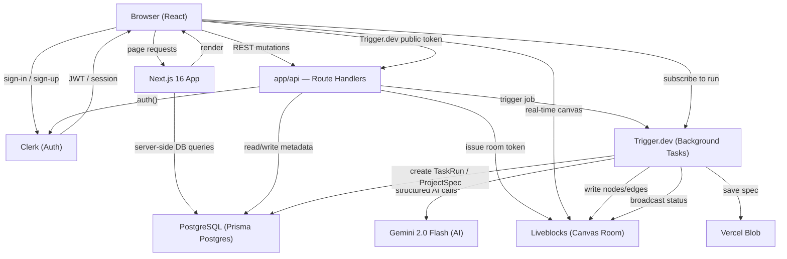
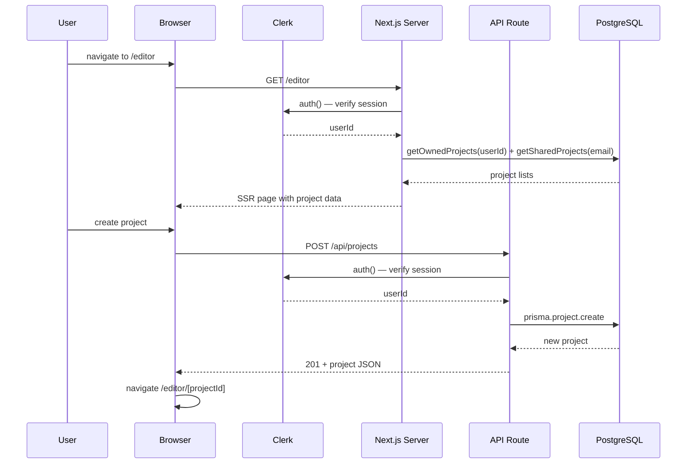
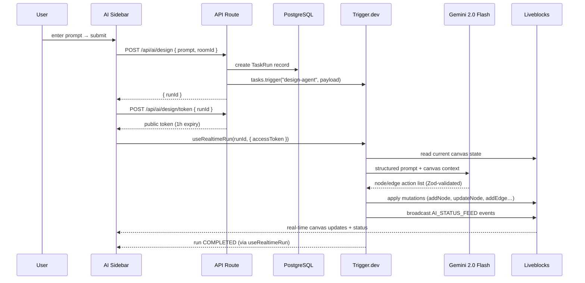
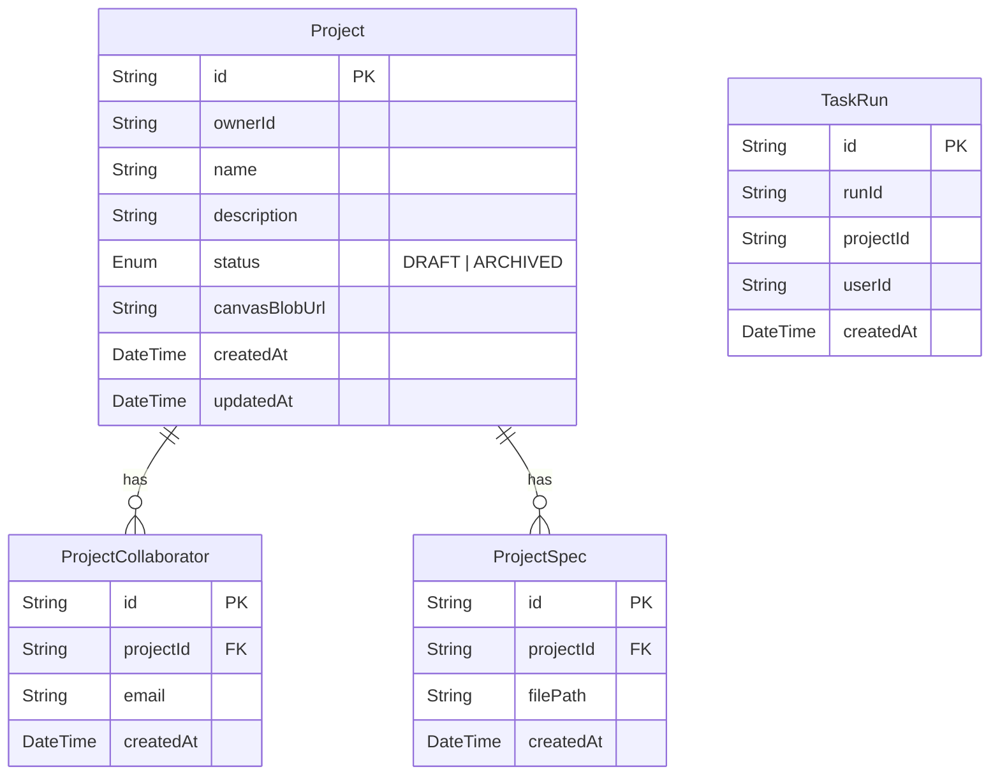
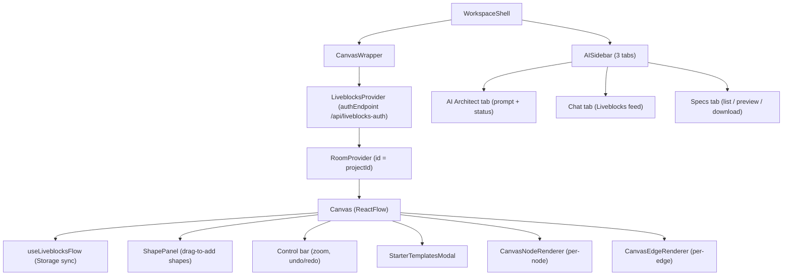
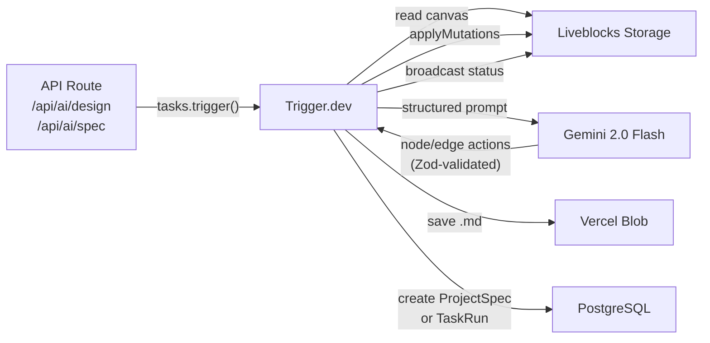

# Ghost AI — Architecture

Real-time collaborative system design workspace. Users describe a system in plain English, an AI agent maps it onto a shared canvas, collaborators refine the design, and the app generates a technical specification from the resulting graph.

---

## Stack

| Layer            | Technology                          | Role                                                           |
| ---------------- | ----------------------------------- | -------------------------------------------------------------- |
| Framework        | Next.js 16 + TypeScript             | Full-stack app with server/client boundaries                   |
| UI               | Tailwind v4 + shadcn/ui (base-nova) | Component composition and styling                              |
| Auth             | Clerk v7                            | User identity and route protection                             |
| Database         | Prisma v7 + PostgreSQL              | Relational metadata: projects, collaborators, specs, task runs |
| Canvas           | Liveblocks + React Flow             | Real-time collaborative canvas, presence, cursors              |
| Background tasks | Trigger.dev                         | Durable AI generation workflows                                |
| AI model         | Gemini 2.0 Flash                    | Structured canvas generation and spec authoring                |
| Artifact storage | Vercel Blob                         | Canvas snapshots and generated Markdown specs                  |

---

## High-Level System Diagram


```mermaid
graph TD
    Browser["Browser (React)"]
    Clerk["Clerk (Auth)"]
    NextApp["Next.js 16 App"]
    API["app/api — Route Handlers"]
    DB["PostgreSQL (Prisma Postgres)"]
    Blob["Vercel Blob"]
    Liveblocks["Liveblocks (Canvas Room)"]
    Trigger["Trigger.dev (Background Tasks)"]
    Gemini["Gemini 2.0 Flash (AI)"]

    Browser -->|"sign-in / sign-up"| Clerk
    Clerk -->|"JWT / session"| Browser
    Browser -->|"page requests"| NextApp
    NextApp -->|"server-side DB queries"| DB
    NextApp -->|"render"| Browser
    Browser -->|"REST mutations"| API
    API -->|"auth()"| Clerk
    API -->|"read/write metadata"| DB
    API -->|"trigger job"| Trigger
    API -->|"issue room token"| Liveblocks
    Browser -->|"real-time canvas"| Liveblocks
    Browser -->|"Trigger.dev public token"| API
    Browser -->|"subscribe to run"| Trigger
    Trigger -->|"structured AI calls"| Gemini
    Trigger -->|"write nodes/edges"| Liveblocks
    Trigger -->|"broadcast status"| Liveblocks
    Trigger -->|"save spec"| Blob
    Trigger -->|"create TaskRun / ProjectSpec"| DB
```

---

## Request / Auth Flow


```mermaid
sequenceDiagram
    participant User
    participant Browser
    participant Clerk
    participant NextServer as Next.js Server
    participant API as API Route
    participant DB as PostgreSQL

    User->>Browser: navigate to /editor
    Browser->>NextServer: GET /editor
    NextServer->>Clerk: auth() — verify session
    Clerk-->>NextServer: userId
    NextServer->>DB: getOwnedProjects(userId) + getSharedProjects(email)
    DB-->>NextServer: project lists
    NextServer-->>Browser: SSR page with project data

    User->>Browser: create project
    Browser->>API: POST /api/projects
    API->>Clerk: auth() — verify session
    Clerk-->>API: userId
    API->>DB: prisma.project.create
    DB-->>API: new project
    API-->>Browser: 201 + project JSON
    Browser->>Browser: navigate /editor/[projectId]
```

---

## AI Generation Flow


```mermaid
sequenceDiagram
    participant User
    participant AISidebar as AI Sidebar
    participant API as API Route
    participant DB as PostgreSQL
    participant Trigger as Trigger.dev
    participant Gemini as Gemini 2.0 Flash
    participant Liveblocks

    User->>AISidebar: enter prompt → submit
    AISidebar->>API: POST /api/ai/design { prompt, roomId }
    API->>DB: create TaskRun record
    API->>Trigger: tasks.trigger("design-agent", payload)
    API-->>AISidebar: { runId }
    AISidebar->>API: POST /api/ai/design/token { runId }
    API-->>AISidebar: public token (1h expiry)
    AISidebar->>Trigger: useRealtimeRun(runId, { accessToken })

    Trigger->>Liveblocks: read current canvas state
    Trigger->>Gemini: structured prompt + canvas context
    Gemini-->>Trigger: node/edge action list (Zod-validated)
    Trigger->>Liveblocks: apply mutations (addNode, updateNode, addEdge…)
    Trigger->>Liveblocks: broadcast AI_STATUS_FEED events
    Liveblocks-->>AISidebar: real-time canvas updates + status
    Trigger-->>AISidebar: run COMPLETED (via useRealtimeRun)
```

---

## Data Model


```mermaid
erDiagram
    Project {
        String   id             PK
        String   ownerId
        String   name
        String   description
        Enum     status         "DRAFT | ARCHIVED"
        String   canvasBlobUrl
        DateTime createdAt
        DateTime updatedAt
    }

    ProjectCollaborator {
        String   id        PK
        String   projectId FK
        String   email
        DateTime createdAt
    }

    ProjectSpec {
        String   id        PK
        String   projectId FK
        String   filePath
        DateTime createdAt
    }

    TaskRun {
        String   id        PK
        String   runId
        String   projectId
        String   userId
        DateTime createdAt
    }

    Project ||--o{ ProjectCollaborator : "has"
    Project ||--o{ ProjectSpec : "has"
```

**Storage split:**

- `projects`, `project_collaborators`, `project_specs`, `task_runs` live in PostgreSQL.
- Canvas content is synced in real time via Liveblocks Storage and persisted to Vercel Blob at `canvas/{projectId}.json` via `/api/projects/[projectId]/canvas`.
- Generated specs are stored at `specs/{projectId}/{specId}.md` in Vercel Blob; the URL is stored in `ProjectSpec.filePath`.
- `TaskRun` records link Trigger.dev run IDs to projects and users for access-control token issuance.

---

## Directory Structure

```text
ghost-ai/
├── app/
│   ├── api/
│   │   ├── ai/
│   │   │   ├── design/
│   │   │   │   ├── route.ts              # POST: trigger design-agent, create TaskRun
│   │   │   │   └── token/
│   │   │   │       └── route.ts          # POST: issue Trigger.dev public token for design run
│   │   │   └── spec/
│   │   │       ├── route.ts              # POST: trigger generate-spec, create TaskRun
│   │   │       └── token/
│   │   │           └── route.ts          # POST: issue Trigger.dev public token for spec run
│   │   ├── liveblocks-auth/
│   │   │   └── route.ts                  # POST: issue Liveblocks room token
│   │   └── projects/
│   │       ├── route.ts                  # GET list, POST create
│   │       └── [projectId]/
│   │           ├── route.ts              # PATCH rename, DELETE delete
│   │           ├── canvas/
│   │           │   └── route.ts          # GET fetch canvas blob, PUT save canvas blob
│   │           ├── collaborators/
│   │           │   ├── route.ts          # GET list (Clerk-enriched), POST invite
│   │           │   └── [collaboratorId]/
│   │           │       └── route.ts      # DELETE remove collaborator
│   │           └── specs/
│   │               ├── route.ts          # GET list specs
│   │               └── [specId]/
│   │                   └── download/
│   │                       └── route.ts  # GET download spec as .md attachment
│   ├── editor/
│   │   ├── page.tsx                      # SSR: fetch projects, render EditorShell
│   │   └── [roomId]/
│   │       └── page.tsx                  # SSR: auth + access check, render WorkspaceShell
│   ├── sign-in/[[...sign-in]]/
│   ├── sign-up/[[...sign-up]]/
│   ├── generated/prisma/                 # Prisma-generated client (do not edit)
│   ├── globals.css                       # Tailwind v4 CSS-first tokens
│   ├── layout.tsx                        # ClerkProvider + dark class on <html>
│   └── page.tsx                          # Root: redirect auth'd → /editor
├── components/
│   ├── editor/
│   │   ├── access-denied.tsx             # Lock icon + back link for unauthorized access
│   │   ├── ai-sidebar.tsx                # AI Architect / Chat / Specs panel
│   │   ├── canvas-edge.tsx               # Custom edge: smooth-step routing, inline label editing
│   │   ├── canvas-node.tsx               # Custom node: shape rendering, resize, color, label editing
│   │   ├── canvas-wrapper.tsx            # LiveblocksProvider → RoomProvider → Canvas
│   │   ├── canvas.tsx                    # ReactFlow canvas with Liveblocks sync
│   │   ├── editor-navbar.tsx
│   │   ├── editor-shell.tsx              # Client wrapper for editor home
│   │   ├── presence-avatars.tsx          # Real-time collaborator avatars (Liveblocks presence)
│   │   ├── project-dialogs.tsx
│   │   ├── project-sidebar.tsx
│   │   ├── shape-panel.tsx               # Draggable shape toolbar (bottom-center)
│   │   ├── share-dialog.tsx              # Invite collaborators, list/remove members
│   │   ├── starter-templates-modal.tsx   # Template picker with SVG previews
│   │   ├── starter-templates.ts          # CANVAS_TEMPLATES (Microservices, CI/CD, Event-Driven)
│   │   └── workspace-shell.tsx           # Workspace layout: navbar, sidebar, canvas, AI sidebar
│   └── ui/                               # shadcn/ui components (do not edit)
├── hooks/
│   ├── use-keyboard-shortcuts.ts         # Zoom ±, undo/redo keyboard bindings
│   └── use-project-actions.ts            # Dialog state + API mutations
├── lib/
│   ├── liveblocks.ts                     # getLiveblocks() lazy factory + getUserCursorColor()
│   ├── prisma.ts                         # Singleton PrismaClient with PrismaPg + Accelerate
│   ├── project-access.ts                 # getCurrentIdentity(), getProjectWithAccess(), enrichCollaborators()
│   ├── projects.ts                       # Server-only DB query helpers
│   ├── slug.ts
│   ├── utils.ts                          # cn() helper
│   └── validation.ts                     # isValidProjectId(), isValidEmail()
├── trigger/
│   ├── design-agent.ts                   # AI canvas generation (Gemini 2.0 Flash, Liveblocks mutations)
│   ├── generate-spec.ts                  # Markdown spec generation → Vercel Blob → ProjectSpec record
│   └── example.ts                        # Placeholder hello-world task
├── types/
│   ├── canvas.ts                         # NODE_COLORS, NODE_SHAPES, NodeData, CanvasNode, CanvasEdge
│   ├── project.ts                        # Re-exports Prisma Project type
│   └── tasks.ts                          # Zod schemas: aiStatusMessageSchema, designMessageSchema, chatMessageSchema
├── prisma/
│   ├── schema.prisma                     # Generator + datasource
│   ├── models/
│   │   ├── project.prisma                # Project + ProjectCollaborator models
│   │   ├── spec.prisma                   # ProjectSpec model
│   │   └── task-run.prisma              # TaskRun model
│   └── migrations/
├── context/                              # Living documentation (not shipped)
├── proxy.ts                              # Clerk middleware (Next.js 16 convention)
└── docs/
    └── architecture.md                   # This file
```

---

## API Routes

| Method   | Path                                                              | Auth       | Description                                      |
| -------- | ----------------------------------------------------------------- | ---------- | ------------------------------------------------ |
| `POST`   | `/api/ai/design`                                                  | Required   | Trigger design-agent; returns `runId`            |
| `POST`   | `/api/ai/design/token`                                            | Required   | Issue Trigger.dev public token for design run    |
| `POST`   | `/api/ai/spec`                                                    | Required   | Trigger generate-spec; returns `runId`           |
| `POST`   | `/api/ai/spec/token`                                              | Required   | Issue Trigger.dev public token for spec run      |
| `GET`    | `/api/projects`                                                   | Required   | List caller's owned projects                     |
| `POST`   | `/api/projects`                                                   | Required   | Create a project (owner = caller)                |
| `PATCH`  | `/api/projects/[projectId]`                                       | Owner only | Rename a project                                 |
| `DELETE` | `/api/projects/[projectId]`                                       | Owner only | Delete a project (cascades collaborators)        |
| `GET`    | `/api/projects/[projectId]/canvas`                                | Member     | Fetch canvas snapshot from Vercel Blob           |
| `PUT`    | `/api/projects/[projectId]/canvas`                                | Member     | Save canvas snapshot to Vercel Blob              |
| `GET`    | `/api/projects/[projectId]/specs`                                 | Member     | List generated specs                             |
| `GET`    | `/api/projects/[projectId]/specs/[specId]/download`               | Member     | Download spec as Markdown attachment             |
| `GET`    | `/api/projects/[projectId]/collaborators`                         | Member     | List collaborators (enriched via Clerk)          |
| `POST`   | `/api/projects/[projectId]/collaborators`                         | Owner only | Invite a collaborator by email                   |
| `DELETE` | `/api/projects/[projectId]/collaborators/[collaboratorId]`        | Owner only | Remove a collaborator                            |
| `POST`   | `/api/liveblocks-auth`                                            | Member     | Issue a Liveblocks room access token             |

All routes return `401` for unauthenticated requests and `403` for non-owner/non-member mutations.

---

## Auth and Ownership Rules

- Every project has a single **owner** (Clerk `userId`).
- Additional **collaborators** are linked by email via `ProjectCollaborator`.
- Rename and delete are **owner-only**.
- Liveblocks room tokens are issued only after verifying project membership (owner or collaborator).
- Trigger.dev public tokens are scoped to a specific run ID and expire after 1 hour; they are issued only to project members.
- Route protection uses Clerk's `proxy.ts` middleware (Next.js 16 naming convention for `middleware.ts`).

---

## Canvas Architecture

The canvas is built on React Flow + Liveblocks. All node/edge state lives in Liveblocks Storage and is synced in real time across collaborators via `useLiveblocksFlow`.


```mermaid
graph TD
    WorkspaceShell["WorkspaceShell"] --> CanvasWrapper["CanvasWrapper"]
    WorkspaceShell --> AISidebar["AISidebar (3 tabs)"]
    CanvasWrapper --> LiveblocksProvider["LiveblocksProvider (authEndpoint /api/liveblocks-auth)"]
    LiveblocksProvider --> RoomProvider["RoomProvider (id = projectId)"]
    RoomProvider --> Canvas["Canvas (ReactFlow)"]
    Canvas --> useLiveblocksFlow["useLiveblocksFlow (Storage sync)"]
    Canvas --> ShapePanel["ShapePanel (drag-to-add shapes)"]
    Canvas --> ControlBar["Control bar (zoom, undo/redo)"]
    Canvas --> StarterTemplatesModal["StarterTemplatesModal"]
    Canvas --> CanvasNodeRenderer["CanvasNodeRenderer (per-node)"]
    Canvas --> CanvasEdgeRenderer["CanvasEdgeRenderer (per-edge)"]
    AISidebar --> DesignTab["AI Architect tab (prompt + status)"]
    AISidebar --> ChatTab["Chat tab (Liveblocks feed)"]
    AISidebar --> SpecsTab["Specs tab (list / preview / download)"]
```

**Node capabilities:** 6 shapes (rectangle, diamond, circle, pill, cylinder, hexagon), 8 color themes, drag-to-add from shape panel, inline label editing (double-click), resize handles, floating color picker toolbar.

**Edge capabilities:** Smooth-step routing with rounded corners, wide (20px) click hit area, opacity fade at rest, inline label editing (double-click), ArrowClosed marker.

**Ergonomics:** Keyboard shortcuts (`+`/`-` zoom, `Cmd+Z`/`Cmd+Shift+Z` undo/redo), floating control bar (bottom-left), starter templates modal with inline SVG previews.

**Liveblocks Presence:** `cursor: {x,y}|null`, `isThinking: boolean`. Cursor color is deterministically assigned per-user from a 10-color palette.

**Liveblocks Feeds:** `AI_STATUS_FEED` broadcasts task status during AI generation. `AI_CHAT_FEED` carries real-time team chat messages.

---

## Background Tasks


```mermaid
flowchart LR
    API["API Route\n/api/ai/design\n/api/ai/spec"] -->|"tasks.trigger()"| Trigger["Trigger.dev"]
    Trigger -->|"read canvas"| Liveblocks["Liveblocks Storage"]
    Trigger -->|"structured prompt"| Gemini["Gemini 2.0 Flash"]
    Gemini -->|"node/edge actions\n(Zod-validated)"| Trigger
    Trigger -->|"applyMutations"| Liveblocks
    Trigger -->|"broadcast status"| Liveblocks
    Trigger -->|"save .md"| Blob["Vercel Blob"]
    Trigger -->|"create ProjectSpec\nor TaskRun"| DB["PostgreSQL"]
```

| Task | File | Description |
| ---- | ---- | ----------- |
| `design-agent` | `trigger/design-agent.ts` | Accepts prompt + roomId. Reads Liveblocks canvas state, calls Gemini with a structured Zod schema, applies node/edge mutations in real time. Broadcasts status via `AI_STATUS_FEED`. Max duration 300s. |
| `generate-spec` | `trigger/generate-spec.ts` | Accepts projectId + roomId + chatHistory. Reads canvas, generates Markdown spec via Gemini, uploads to Vercel Blob, creates `ProjectSpec` record. 3 retries with exponential backoff. |

Request handlers never block on AI work — they enqueue a job and return `runId` immediately. The frontend uses `useRealtimeRun()` with a scoped public token to track progress.

---

## Key Invariants

1. Request handlers do not run long-lived AI work — that belongs in background tasks.
2. Metadata (ownership, relationships, task runs, spec refs) lives in PostgreSQL; large generated artifacts live in Vercel Blob.
3. Auth and ownership are enforced at every mutation boundary.
4. Client components are used only where browser interactivity or real-time state requires them.
5. Canvas schema must remain consistent between user-created content and imported starter templates.
6. `withAccelerate()` is applied unconditionally — it is a no-op for direct PostgreSQL URLs and activates automatically for `prisma+postgres://` (Prisma Accelerate).
7. Trigger.dev public tokens are scoped to specific run IDs and must be verified against `TaskRun` records before issuance.

---

## Implementation Status

| Feature                                                             | Status  |
| ------------------------------------------------------------------- | ------- |
| Design system (shadcn/ui, Tailwind v4, tokens)                      | Done    |
| Editor chrome (navbar, sidebar)                                     | Done    |
| Authentication (Clerk, sign-in/sign-up, route protection)           | Done    |
| Project dialogs and editor home UI                                  | Done    |
| Prisma data models + migration                                      | Done    |
| Project REST API (list, create, rename, delete)                     | Done    |
| Wire editor home to real API                                        | Done    |
| Workspace shell (per-project route, access-denied, share dialog)    | Done    |
| Collaborator API (invite, list, remove + Clerk enrichment)          | Done    |
| Liveblocks auth + presence (cursor color, isThinking)               | Done    |
| Base canvas (LiveblocksProvider, RoomProvider, ReactFlow)           | Done    |
| Shape panel + drag-to-add                                           | Done    |
| Node shape rendering + drag preview                                 | Done    |
| Node resizing + inline label editing                                | Done    |
| Floating color toolbar                                              | Done    |
| Custom edges (smooth-step, wide hit area, inline labels)            | Done    |
| Canvas ergonomics (keyboard shortcuts, control bar, undo/redo)      | Done    |
| Starter templates (3 templates, SVG preview, import to canvas)      | Done    |
| Canvas persistence (Vercel Blob snapshot via PUT/GET)               | Done    |
| AI design generation (Trigger.dev + Gemini 2.0 Flash)               | Done    |
| AI sidebar (prompt input, status, chat, specs tabs)                 | Done    |
| Spec generation + download                                          | Done    |
| Presence avatars                                                    | Done    |
