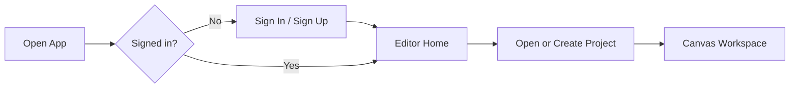
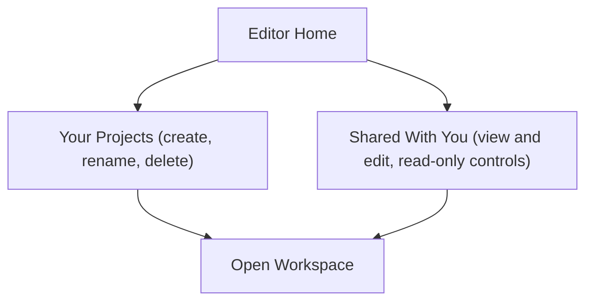
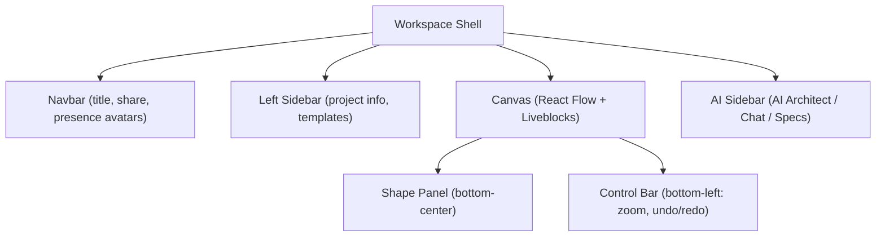
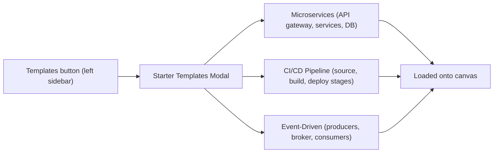
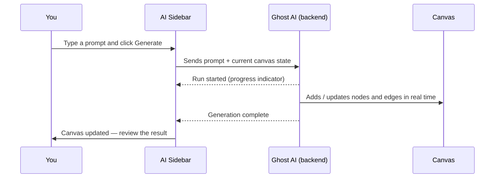
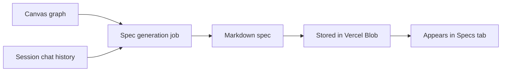
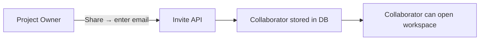

# Ghost AI — User Guide

Ghost AI is a real-time collaborative workspace for designing software architecture. Describe a system in plain English, let the AI generate the architecture on a shared canvas, refine it with your team, and export a technical specification.

---

## Table of Contents

1. [Getting Started](#getting-started)
2. [Managing Projects](#managing-projects)
3. [The Canvas](#the-canvas)
4. [Shapes and Nodes](#shapes-and-nodes)
5. [Edges and Connections](#edges-and-connections)
6. [Starter Templates](#starter-templates)
7. [AI Design Generation](#ai-design-generation)
8. [Spec Generation](#spec-generation)
9. [Collaborating in Real Time](#collaborating-in-real-time)
10. [Keyboard Shortcuts](#keyboard-shortcuts)

---

## Getting Started

### Sign In

Navigate to the app and sign in with your email or social account via Clerk. After authenticating you land on the **Editor Home** — your project dashboard.

---

## Managing Projects

### Editor Home

The Editor Home lists all projects you **own** and projects you've been **invited to collaborate on**.

### Creating a Project

Click **New Project** and enter a name. The project is created immediately and you are the owner.

### Renaming a Project

Open the project's context menu (three-dot icon) and select **Rename**. Only the project owner can rename.

### Deleting a Project

Open the context menu and select **Delete**. Deletion is permanent and cascades to all collaborators, specs, and canvas data. Only the owner can delete.

---

## The Canvas

Opening a project takes you to the **Workspace**. The canvas fills the center of the screen.

### Navigating the Canvas

| Action                | How                                             |
| --------------------- | ----------------------------------------------- |
| Pan                   | Click and drag on empty canvas                  |
| Zoom in / out         | Scroll wheel, pinch gesture, or `+` / `-` keys  |
| Fit to screen         | Click the fit-view button in the control bar    |
| Select a node or edge | Click it                                        |
| Select multiple       | Hold `Shift` and click, or drag a selection box |

---

## Shapes and Nodes

Nodes represent architectural components — services, databases, queues, clients, and so on.

### Adding Nodes

Drag a shape from the **Shape Panel** at the bottom of the canvas and drop it where you want it.

Available shapes:

| Shape     | Typical use                    |
| --------- | ------------------------------ |
| Rectangle | Service, module, layer         |
| Diamond   | Decision point, gateway        |
| Circle    | External actor, user           |
| Pill      | Middleware, proxy, API gateway |
| Cylinder  | Database, storage              |
| Hexagon   | Message broker, event bus      |

### Editing a Node

| Action       | How                                                            |
| ------------ | -------------------------------------------------------------- |
| Move         | Drag the node                                                  |
| Resize       | Drag the resize handle (bottom-right corner)                   |
| Edit label   | Double-click the node                                          |
| Change color | Select the node → click a color swatch in the floating toolbar |
| Delete       | Select the node → press `Backspace` or `Delete`                |

### Node Colors

Eight color themes are available. Select a node to open the floating color toolbar and pick a theme. Colors are shared across all collaborators in real time.

---

## Edges and Connections

Edges represent data flow, API calls, messaging channels, and other relationships between components.

### Drawing an Edge

Hover over a node until connection handles appear on its border, then drag from a handle to another node.

### Editing an Edge

| Action                 | How                                             |
| ---------------------- | ----------------------------------------------- |
| Add a label            | Double-click the edge                           |
| Edit an existing label | Double-click the edge label                     |
| Delete                 | Select the edge → press `Backspace` or `Delete` |

Edges use smooth-step routing with rounded corners and have a wide invisible hit area (20 px) to make them easy to click.

---

## Starter Templates

If you're starting from scratch, the **Starter Templates** modal gives you three pre-built architectures to load onto the canvas.

Each template shows an SVG preview before you import. Importing a template **replaces** the current canvas content.

---

## AI Design Generation

The **AI Architect** tab in the right-side AI Sidebar lets you describe a system in plain English and have Ghost AI generate nodes and edges directly on the shared canvas.

### How It Works

### Writing Good Prompts

The AI reads the current canvas before generating, so you can build incrementally.

| Goal                   | Example prompt                                                                                    |
| ---------------------- | ------------------------------------------------------------------------------------------------- |
| Generate from scratch  | "Design a scalable e-commerce backend with a product catalog, order service, and payment gateway" |
| Add a layer            | "Add a Redis cache between the API gateway and the user service"                                  |
| Extend existing design | "Add monitoring and alerting components to this architecture"                                     |
| Specific technology    | "Replace the message queue with Apache Kafka and add two consumer groups"                         |

**Tip:** Use starter prompt chips ("Design an e-commerce backend", "Create a chat app architecture", "Build a CI/CD pipeline") for a quick start.

### During Generation

- A status indicator shows the current generation step.
- Nodes and edges appear on the canvas **as they are created** — you can watch the design build in real time.
- Collaborators see the canvas update live and a presence indicator shows Ghost AI is "thinking".
- The **Generate** button is disabled while a run is in progress.

### After Generation

Review the canvas and make adjustments manually. You can run the AI again with a follow-up prompt to refine, extend, or restructure the design.

---

## Spec Generation

Once your canvas represents the architecture you want, generate a formal **Technical Specification** from it.

### Generating a Spec

Click the **Generate Spec** button in the AI Sidebar (available in the AI Architect tab after a design exists on the canvas). The AI reads the full canvas graph and the session chat history, then produces a structured Markdown document.

### The Specs Tab

Switch to the **Specs** tab in the AI Sidebar to see all specs generated for this project, with creation timestamps.

| Action   | How                                            |
| -------- | ---------------------------------------------- |
| Preview  | Click a spec to open it in a read-only modal   |
| Download | Click the Download button — saves a `.md` file |

Specs are permanent records; generating a new one does not overwrite previous ones.

---

## Collaborating in Real Time

Ghost AI is built for teams. Multiple people can work on the same canvas simultaneously.

### Inviting Collaborators

Click **Share** in the top navbar and enter a collaborator's email address. They receive access immediately and can open the project from their own Editor Home.

**Note:** Only the project owner can invite or remove collaborators.

### Real-Time Presence

When collaborators are in the same workspace you'll see:

- **Cursor positions** — each user's cursor is shown in a distinct color with their name.
- **Presence avatars** — avatar stack in the top navbar shows who is currently online.
- **AI thinking indicator** — when Ghost AI is generating, a "thinking" status is broadcast to all collaborators.

### Permissions Summary

| Action               | Owner | Collaborator |
| -------------------- | ----- | ------------ |
| View canvas          | ✓     | ✓            |
| Edit canvas          | ✓     | ✓            |
| Run AI generation    | ✓     | ✓            |
| Generate spec        | ✓     | ✓            |
| Invite collaborators | ✓     | —            |
| Remove collaborators | ✓     | —            |
| Rename project       | ✓     | —            |
| Delete project       | ✓     | —            |

---

## Keyboard Shortcuts

| Shortcut                       | Action                       |
| ------------------------------ | ---------------------------- |
| `+`                            | Zoom in                      |
| `-`                            | Zoom out                     |
| `Cmd Z` / `Ctrl Z`             | Undo                         |
| `Cmd Shift Z` / `Ctrl Shift Z` | Redo                         |
| `Backspace` / `Delete`         | Delete selected node or edge |
| `Double-click node`            | Edit node label              |
| `Double-click edge`            | Edit edge label              |
